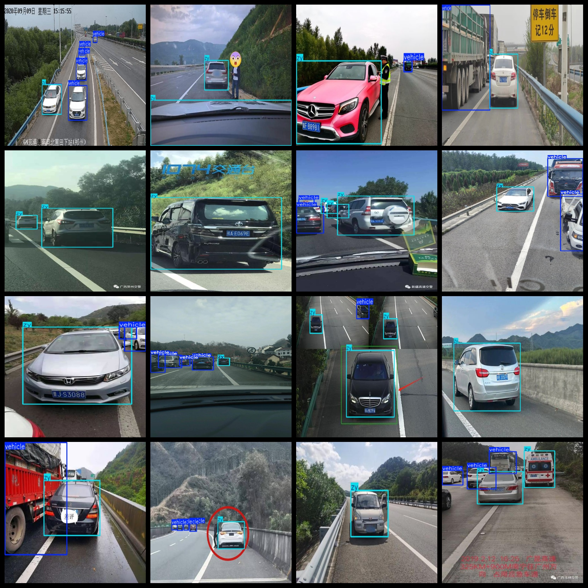
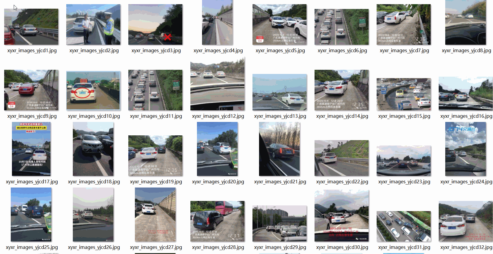

# Vehicle Occupancy Contingency Vehicle Word Detection Dataset
577 images in VOC+YOLO format

The dataset is organized as follows: 3 folders, each storing images, XML files, and .txt files.

The JPEGImages folder contains a total of 577 JPG images.

The Annotations folder contains a total of 577 XML files.

The labels folder contains a total of 577 .txt files.

There are a total of 4 types of labels: ["vehicle", "zy", "zy-110", "zy-120"].

Each label category has a number of bounding boxes (Note: the order of categories in the YOLO format does not match this, but it is based on the classes.txt in the labels folder).

vehicle bounding box count = 1369 (vehicles)

zy bounding box count = 887 (occupying emergency lane vehicles)

zy-110 bounding box count = 9 (police cars at an emergency lane 110)

zy-120 bounding box count = 2 (ambulances at an emergency lane 120)

Total bounding box count = 2267

Image resolution (pixels): Clear

Image enhancement: Yes

Label shape: Rectangular boxes for target detection recognition

Important Note: No guarantees are made regarding the accuracy or weights of the models trained on this dataset. The dataset only provides accurate and reasonable annotations.

## Images

---

Here is a pay link on Stripe (https://buy.stripe.com/3cs8yP7sY87d0vu9AB). Please contact me lonlonago@foxmail.com after funding $89, and I will send you a complete data files, thank you!

